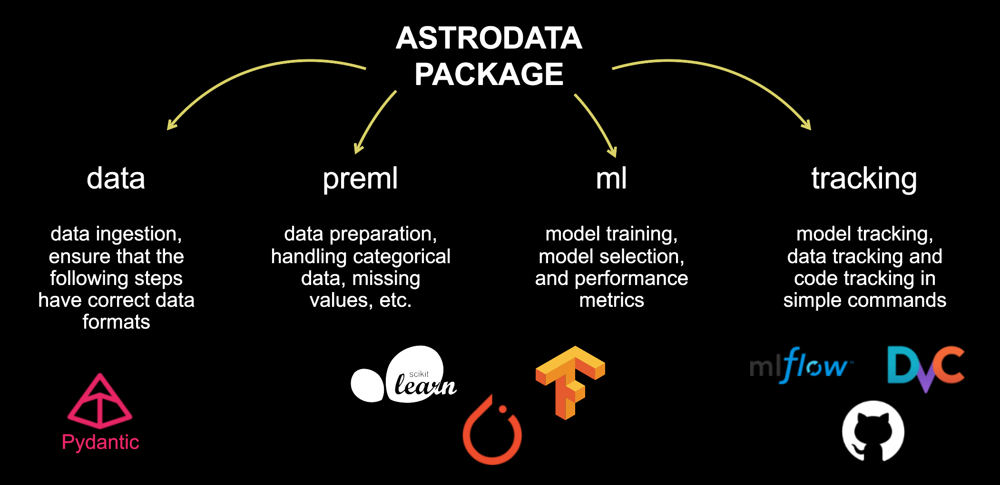

# Introduction

AstroData is a modular Python toolkit for data processing, machine learning, and experiment tracking, designed for astrophysical data workflows. This project is part of Italy’s National Recovery and Resilience Plan (PNRR), coordinated by the National Institute for Astrophysics (INAF) under the Spoke 3 initiative, which focuses on advanced data analysis and artificial intelligence for astrophysics.

The goal of astrodata is to provide robust pipelines for data ingestion, preprocessing, model training, evaluation, and experiment tracking with integrated support for Git and DVC.

 

## Features

- **Data Pipelines**: Modular data loaders, processors, and schemas for handling raw and processed data.
- **Preprocessing**: Utilities for normalization, one-hot encoding, and custom preprocessing steps.
- **Machine Learning**: Abstract base classes and utilities for metrics, model selection, and model management.
- **Experiment Tracking**: Integrated code and data tracking using Git and DVC, with MLflow support.
- **Extensible**: Easily extend with custom data processors, models, and metrics.

## Python quick start

Install the package directly from GitHub using any package manager such as pip, uv, and conda, the package requires `python >= 3.10`.
```sh
pip install git+https://github.com/Astrodata-project/astrodata.git
```

## Project Structure

```
astrodata/
    data/         # Data loaders, schemas, processors, and utilities
    ml/           # ML metrics, model selection, and models
    preml/        # Preprocessing pipelines and processors
    tracking/     # Code/data tracking (Git, DVC, MLflow)
    utils/        # Logging and general utilities
docs/             # Sphinx documentation
examples/         # Example scripts and notebooks
tests/            # Unit and integration tests
```