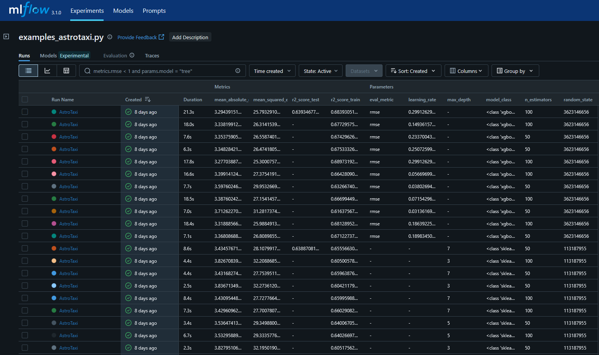

# Model Tracking

The `astrodata.tracking` module provides capabilities for experiment tracking, primarily through integration with MLflow. This allows users to log model parameters, metrics, artifacts, and manage different versions of their machine learning models.

## Abstract Classes


**`ModelTracker`** is the abstract base class that all model trackers should inherit from. It defines the fundamental methods that a model tracker object must implement:
* `wrap_fit(BaseMlModel)`: Takes as input a model and returns the same model with its `fit` method now able to log the model to the required service.

## How to Use

### Initializing a tracker

How a tracker is initialized depends on the tracker implementation. Once a tracker is initialized, all that's needed is to call its `wrap_fit()` method with an already initialized model as argument to get the same model with the wrapped `fit()` method as output. Once this is done you can proceed by using the model as usual.

```python
from astrodata.tracking.ModelTracker import ModelTracker
from astrodata.ml.models.BaseMlModel import BaseMlModel

model = BaseMlModel( ... )
tracker = ModelTracker( ... )

tracked_model = tracker.wrap_fit(model)

tracked_model.fit(X_train, y_train)
```

Whenever you call the `.fit` method of the model after wrapping it, the tracker will handle logging it to its own service; when using an `MlFlowTracker` for example, the logs are either stored locally or in an external server whenever the model is fitted, each run represent a call of the `.fit` method and it containes the information of the logged metrics, the model's parameters and any artifact (the model files) that may be stored. Different services store different things, but as the most used open source ml-ops application, `astrodata` implements MlFlow by default.



## `MLFlowTracker`

As previously stated, an `MlFlowTracker` represent an MlFlow implementation of a `ModelTracker`, the class is a base on top of which framework specific trackers should be build (such as `SklearnMLflowTracker`) as it does not feature a `wrap_fit()` method, but it implements all the required methods to store the relevant informations that are required to connect to and use an MlFlow server 

### Parameters

* **run_name** : str, optional
    * Name for MLflow run.
* **experiment_name** : str, optional
    * Name of the MLflow experiment.
* **extra_tags** : dict, optional
    * Extra tags to log with the run.
* **tracking_uri** : str, optional
    * MLflow tracking server URI.
* **tracking_username** : str, optional
    * Username for authentication (if needed).
* **tracking_password** : str, optional
    * Password for authentication (if needed).

## `SklearnMLflowTracker`

This class extends `MlFlowTracker` to give it a proper `wrap_fit()` method that is suitable to track `scikit-learn` compatible models.

```{attention}
`XgBoostModel` is a `scikit-learn` compatible model so it uses the same tracker!
```

### `SklearnMLflowTracker.wrap_fit()` parameters

* **model** : BaseMlModel
    * The model to wrap.
* **X_test** : array-like, optional
    * Test data for metric logging.
* **y_test** : array-like, optional
    * Test labels for metric logging.
* **X_val** : array-like, optional
    * Validation data for metric logging.
* **y_val** : array-like, optional
    * Validation labels for metric logging.
* **metrics** : list of BaseMetric, optional
    * Metrics to log. If missing, a default loss metric is added.
* **log_model** : bool, optional
    * If True, log the fitted model as an MLflow artifact.
* **tags**: Dict[str, Any] default {}
    * Any additional tags that should be added to the model.

### Example `wrap_fit()` usage

When calling the `wrap_fit()` method on an existing model, some parameters are passed to allow for correct metrics computation such as a `metrics` array (which logs the model loss by default), data to test on (either `X_val/y_val` or `X_test/y_test`), and any additional tag that we want to add while logging the model.

```python
from sklearn.ensemble import GradientBoostingClassifier
from astrodata.ml.models.SklearnModel import SklearnModel
from astrodata.tracking.MLFlowTracker import SklearnMLflowTracker

gradientboost = SklearnModel(model_class=GradientBoostingClassifier)

tracker = SklearnMLflowTracker(
        run_name="MlFlowSimpleRun",
        experiment_name="simple_example",
        extra_tags={"stage": "testing"},
    )

tracked_gradientboost = tracker.wrap_fit(
        gradientboost, X_test=X_test, y_test=y_test, metrics=metrics, log_model=True
    )

tracked_gradientboost.fit(X_train, y_train)
```

## Examples

- [Basic `SklearnMLflowTracker` usage](<project:../python_examples/ml/5_mlflow_simple_example.rst>)
- [`GridSearchSelector` with MlFlow tracking](<project:../python_examples/ml/6_mlflow_gs_example.rst>)
- [`HyperOptSelector` with MlFlow tracking](<project:../python_examples/ml/7_mlflow_hp_example.rst>)