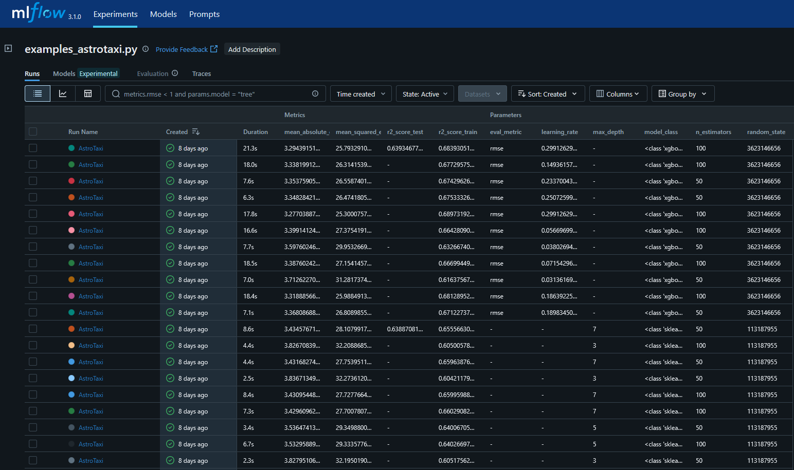

# Model Tracking

The `astrodata.tracking` module provides capabilities for experiment tracking, primarily through integration with MLflow. This allows users to log model parameters, metrics, artifacts, and manage different versions of their machine learning models.

## Abstract Classes


**`ModelTracker`** is the abstract base class that all model trackers should inherit from. It defines the fundamental methods that a model tracker object must implement:
* `wrap_fit(BaseMlModel)`: Takes as input a model and returns the same model with its `fit` method now able to log the model to the required service.

## How to Use

### Initializing a tracker

How a tracker is initialized depends on the tracker implementation. Once a tracker is initialized, all that's needed is to call its `wrap_fit()` method with an already initialized model as argument to get the same model with the wrapped `fit()` method as output. Once this is done you can proceed by using the model as usual.

```python
from astrodata.tracking.ModelTracker import ModelTracker
from astrodata.ml.models.BaseMlModel import BaseMlModel

model = BaseMlModel( ... )
tracker = ModelTracker( ... )

tracked_model = tracker.wrap_fit(model)

tracked_model.fit(X_train, y_train)
```

Whenever you call the `.fit` method of the model after wrapping it, the tracker will handle logging it to its own service; when using an `MlFlowTracker` for example, the logs are either stored locally or in an external server whenever the model is fitted, each run represent a call of the `.fit` method and it containes the information of the logged metrics, the model's parameters and any artifact (the model files) that may be stored. Different services store different things, but as the most used open source ml-ops application, `astrodata` implements MlFlow by default.



## `MlflowBaseTracker`

`MlflowBaseTracker` is the base class for MLflow integration with `astrodata`. It provides common MLflow configuration and tracking functionality that framework-specific trackers (such as `SklearnMLflowTracker`, `PytorchMLflowTracker`, and `TensorflowMLflowTracker`) inherit from. This class does not implement the `wrap_fit()` method directly, but provides all the necessary infrastructure for connecting to and using an MLflow tracking server.

```{note}
You should use the framework-specific tracker classes (`SklearnMLflowTracker`, `PytorchMLflowTracker`, `TensorflowMLflowTracker`) rather than `MlflowBaseTracker` directly.
``` 

### Parameters

* **run_name** : str, optional
    * Name for MLflow run.
* **experiment_name** : str, optional
    * Name of the MLflow experiment.
* **extra_tags** : dict, optional
    * Extra tags to log with the run.
* **tracking_uri** : str, optional
    * MLflow tracking server URI.
* **tracking_username** : str, optional
    * Username for authentication (if needed).
* **tracking_password** : str, optional
    * Password for authentication (if needed).

## `SklearnMLflowTracker`

This class extends `MlflowBaseTracker` to provide MLflow tracking for scikit-learn compatible models. It wraps the model's `fit()` method to automatically log parameters, metrics, and optionally the trained model to MLflow.

```{attention}
`XGBoostModel` is scikit-learn compatible and uses the same tracker!
```

### `SklearnMLflowTracker.wrap_fit()` parameters

* **model** : BaseMlModel
    * The model to wrap.
* **X_test** : array-like, optional
    * Test data for metric logging.
* **y_test** : array-like, optional
    * Test labels for metric logging.
* **X_val** : array-like, optional
    * Validation data for metric logging.
* **y_val** : array-like, optional
    * Validation labels for metric logging.
* **metrics** : list of BaseMetric, optional
    * Metrics to log. If missing, a default loss metric is added.
* **log_model** : bool, default False
    * If True, log the fitted model as an MLflow artifact.
* **tags**: Dict[str, Any], default {}
    * Any additional tags that should be added to the model. By default, the tag "is_final" is set equal to `log_model`.
* **manual_metrics** : Tuple[Dict[str, Any], str], optional
    * Manual metrics to log with a split name.
* **run_name** : str, optional
    * Name for the MLflow run. If None, uses tracker's run_name.

### Example `wrap_fit()` usage

When calling the `wrap_fit()` method on an existing model, some parameters are passed to allow for correct metrics computation such as a `metrics` array (which logs the model loss by default), data to test on (either `X_val/y_val` or `X_test/y_test`), and any additional tag that we want to add while logging the model.

```python
from sklearn.ensemble import GradientBoostingClassifier
from astrodata.ml.models.SklearnModel import SklearnModel
from astrodata.tracking.MLFlowTracker import SklearnMLflowTracker

gradientboost = SklearnModel(model_class=GradientBoostingClassifier)

tracker = SklearnMLflowTracker(
        run_name="MlFlowSimpleRun",
        experiment_name="simple_example",
        extra_tags={"stage": "testing"},
    )

tracked_gradientboost = tracker.wrap_fit(
        gradientboost, X_test=X_test, y_test=y_test, metrics=metrics, log_model=True
    )

tracked_gradientboost.fit(X_train, y_train)
```

## `PytorchMLflowTracker`

This class extends `MlflowBaseTracker` to provide MLflow tracking for PyTorch models. It wraps the `PytorchModel` `fit()` method to automatically log parameters, metrics, training history, and optionally the trained model to MLflow.

### `PytorchMLflowTracker.wrap_fit()` parameters

* **model** : PytorchModel
    * The PyTorch model to wrap.
* **X_test** : array-like, optional
    * Test data for metric logging.
* **y_test** : array-like, optional
    * Test labels for metric logging.
* **X_val** : array-like, optional
    * Validation data for metric logging.
* **y_val** : array-like, optional
    * Validation labels for metric logging.
* **dataset_test** : torch.utils.data.Dataset, optional
    * Test dataset for metric logging.
* **dataset_val** : torch.utils.data.Dataset, optional
    * Validation dataset for metric logging.
* **metrics** : list of BaseMetric, optional
    * Metrics to log during training and evaluation.
* **log_model** : bool, default False
    * If True, log the fitted PyTorch model as an MLflow artifact.
* **tags**: Dict[str, Any], default {}
    * Any additional tags to add to the run. By default, "is_final" is set equal to `log_model`.
* **manual_metrics** : Tuple[Dict[str, Any], str], optional
    * Manual metrics to log with a split name.
* **run_name** : str, optional
    * Name for the MLflow run. If None, uses tracker's run_name.

### Example Usage

```python
import torch.nn as nn
import torch.optim as optim
from astrodata.ml.models import PytorchModel
from astrodata.tracking.MLFlowTracker import PytorchMLflowTracker
from astrodata.ml.metrics import SklearnMetric
from sklearn.metrics import accuracy_score

# Define a simple PyTorch model
class SimpleNet(nn.Module):
    def __init__(self, input_dim, hidden_dim, output_dim):
        super().__init__()
        self.fc1 = nn.Linear(input_dim, hidden_dim)
        self.relu = nn.ReLU()
        self.fc2 = nn.Linear(hidden_dim, output_dim)
    
    def forward(self, x):
        x = self.fc1(x)
        x = self.relu(x)
        return self.fc2(x)

# Initialize the model
model = PytorchModel(
    model_class=SimpleNet,
    model_params={"input_dim": 10, "hidden_dim": 64, "output_dim": 2},
    loss_fn=nn.CrossEntropyLoss,
    optimizer=optim.Adam,
    optimizer_params={"lr": 0.001},
    epochs=10,
    batch_size=32
)

# Set up tracking
tracker = PytorchMLflowTracker(
    run_name="pytorch_experiment",
    experiment_name="pytorch_tracking_example",
    extra_tags={"model_type": "SimpleNet"}
)

metrics = [SklearnMetric(accuracy_score)]

tracked_model = tracker.wrap_fit(
    model,
    X_test=X_test,
    y_test=y_test,
    metrics=metrics,
    log_model=True
)

tracked_model.fit(X_train, y_train)
```

## `TensorflowMLflowTracker`

This class extends `MlflowBaseTracker` to provide MLflow tracking for TensorFlow/Keras models. It wraps the `TensorflowModel` `fit()` method to automatically log parameters, metrics, training history, and optionally the trained model to MLflow.

### `TensorflowMLflowTracker.wrap_fit()` parameters

* **model** : TensorflowModel
    * The TensorFlow/Keras model to wrap.
* **X_test** : array-like, optional
    * Test data for metric logging.
* **y_test** : array-like, optional
    * Test labels for metric logging.
* **X_val** : array-like, optional
    * Validation data for metric logging.
* **y_val** : array-like, optional
    * Validation labels for metric logging.
* **dataset_test** : tf.data.Dataset, optional
    * Test dataset for metric logging.
* **dataset_val** : tf.data.Dataset, optional
    * Validation dataset for metric logging.
* **metrics** : list of BaseMetric, optional
    * Metrics to log during training and evaluation.
* **log_model** : bool, default False
    * If True, log the fitted TensorFlow model as an MLflow artifact.
* **tags**: Dict[str, Any], default {}
    * Any additional tags to add to the run. By default, "is_final" is set equal to `log_model`.
* **manual_metrics** : Tuple[Dict[str, Any], str], optional
    * Manual metrics to log with a split name.
* **run_name** : str, optional
    * Name for the MLflow run. If None, uses tracker's run_name.

### Example Usage

```python
import keras as K
from astrodata.ml.models import TensorflowModel
from astrodata.tracking.MLFlowTracker import TensorflowMLflowTracker
from astrodata.ml.metrics import SklearnMetric
from sklearn.metrics import accuracy_score

# Define a simple Keras model
def build_model(input_dim, hidden_dim, output_dim):
    model = K.Sequential([
        K.layers.Dense(hidden_dim, activation='relu', input_shape=(input_dim,)),
        K.layers.Dense(output_dim, activation='softmax')
    ])
    return model

# Initialize the model
model = TensorflowModel(
    model_class=build_model,
    model_params={"input_dim": 10, "hidden_dim": 64, "output_dim": 2},
    loss_fn=K.losses.SparseCategoricalCrossentropy,
    optimizer=K.optimizers.Adam,
    optimizer_params={"learning_rate": 0.001},
    epochs=10,
    batch_size=32
)

# Set up tracking
tracker = TensorflowMLflowTracker(
    run_name="tensorflow_experiment",
    experiment_name="tensorflow_tracking_example",
    extra_tags={"model_type": "SequentialNN"}
)

metrics = [SklearnMetric(accuracy_score)]

tracked_model = tracker.wrap_fit(
    model,
    X_test=X_test,
    y_test=y_test,
    metrics=metrics,
    log_model=True
)

tracked_model.fit(X_train, y_train)
```

## `register_best_model()`

All MLflow tracker classes inherit the `register_best_model()` method from `MlflowBaseTracker`. This method allows you to register the best model from an experiment to the MLflow Model Registry based on a specific metric.

### Parameters

* **metric** : BaseMetric
    * Metric used to select the best run.
* **registered_model_name** : str, optional
    * Name for the registered model. Defaults to experiment name.
* **split_name** : str, default "train"
    * Which split's metric to use ('train', 'val', or 'test').
* **stage** : str, default "Production"
    * Model stage to assign (e.g., 'Production', 'Staging').

### Example

```python
from astrodata.ml.metrics import SklearnMetric
from sklearn.metrics import accuracy_score

# After running multiple experiments
accuracy_metric = SklearnMetric(accuracy_score)
tracker.register_best_model(
    metric=accuracy_metric,
    registered_model_name="best_classifier",
    split_name="test",
    stage="Production"
)
```

## Examples

### Scikit-learn / XGBoost
- [Basic `SklearnMLflowTracker` usage](<project:../python_examples/ml/5_mlflow_simple_example.rst>)
- [`GridSearchSelector` with MLflow tracking](<project:../python_examples/ml/6_mlflow_gs_example.rst>)
- [`HyperOptSelector` with MLflow tracking](<project:../python_examples/ml/7_mlflow_hp_example.rst>)

### PyTorch
- [`PytorchMLflowTracker` usage](<project:../python_examples/ml/11_pytorch_mlflow_example.rst>)

### TensorFlow/Keras
- [`TensorflowMLflowTracker` usage](<project:../python_examples/ml/18_tensorflow_mlflow_example.rst>)